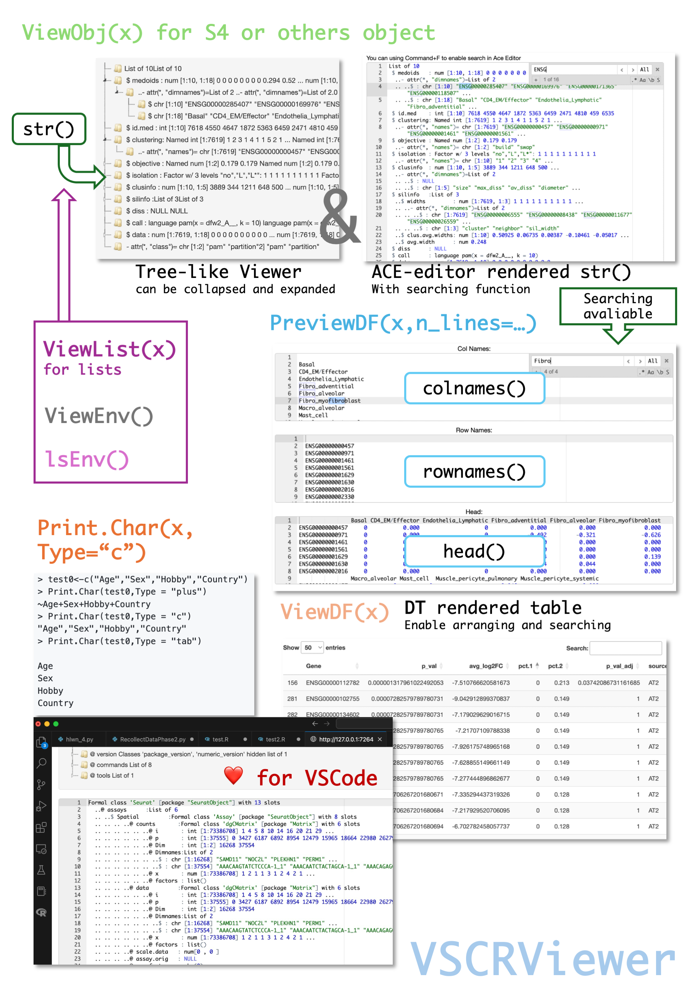

# VSCRViewer : Simple R Object Viewer in VSCode/Terminal

**VSCRViewer** is an R Packages that brings an RStudio-like variable object property preview to the VSCode environment. This tool is designed for R users who want to seamlessly explore the properties of their variables, especially complex objects like S4, directly within VSCode. This package is based on `shiny`.

-   **OverView**:

    

-   **Integrated with VSCode**:

Enjoy the convenience of RStudio’s object inspection capabilities within the powerful VSCode editor.

## Installation

1.  **Requirement**:

    ```         
    packages <- c("dplyr", "DT", "shiny", "shinyAce", "shinyTree", "stringr","devtools")
    install_if_missing <- function(p) {
      if (!requireNamespace(p, quietly = TRUE)) {
        install.packages(p)
      }
    }
    sapply(packages, install_if_missing)
    ```

2.  **Setup**:

    ```         
    devtools::install_github("ZhimingYe/VSCRViewer")
    ```

## Usage

1.  **View S4 or others object**:

    ```         
    VSCRViewer::ViewObj(obj)
    ```

    The core implement is below. You can modify extract patterns by passing Pattern1\~3

    ```         
    dt<-capture.output(str(Test,strict.width="cut"))
    countlist<-c()
    for(i in 1:length(dt)){
        str <- sub("^\\s", "", dt[i])
        matches <- gregexpr("^(( ..)+)", str) # Pattern 1
        matched_part <- regmatches(str, matches)[[1]]
        count <- length(unlist(strsplit(matched_part, " ..")))
        countlist <- c(countlist,count)
    }
    library(stringr)
    Name1list<-c()
    for(i in 1:length(dt)){
        str <- sub(".*\\.\\.([@$#%^&*]+[^:]+):.*", "\\1", dt[i]) # Pattern 2
        Name1list <- c(Name1list,str)
    }
    Name2list<-c()
    for(i in 1:length(dt)){
        str <- sub(".*?:", "", dt[i]) # Pattern 3
        Name2list <- c(Name2list,str)
    }
    ```

2.  **Viewing tables:**

    Viewing:

    ```         
    VSCRViewer::ViewDF(x,n = 10000) # You can determine how many rows is passed to DT
    ```

    Preview:

    ```         
    VSCRViewer::PreviewDF(x)
    ```

3.  **Viewing lists:**

    ```         
    VSCRViewer::ViewList(x)
    ```

4.  **Viewing environment:**

    ```         
    VSCRViewer::ViewEnv()
    VSCRViewer::lsEnv()
    ```

5.  **Viewing vector:**

    ```         
    > c("Age","Sex","Hobby","Country")
    [1] "Age"     "Sex"     "Hobby"   "Country"
    > test0<-c("Age","Sex","Hobby","Country")
    > Print.Char(test0,Type = "plus")
    ~Age+Sex+Hobby+Country
    > Print.Char(test0,Type = "c")
    "Age","Sex","Hobby","Country"
    > Print.Char(test0,Type = "tab")

    Age
    Sex
    Hobby
    Country
    ```

.

## License

GPL-V3
