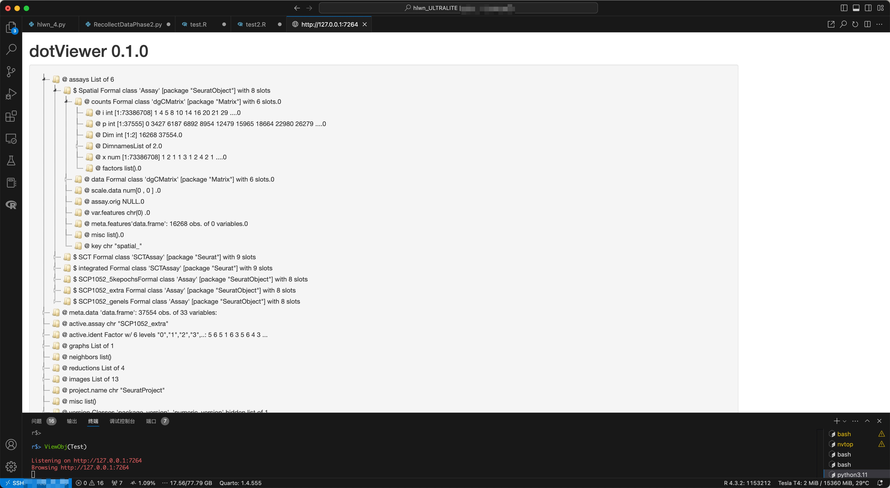
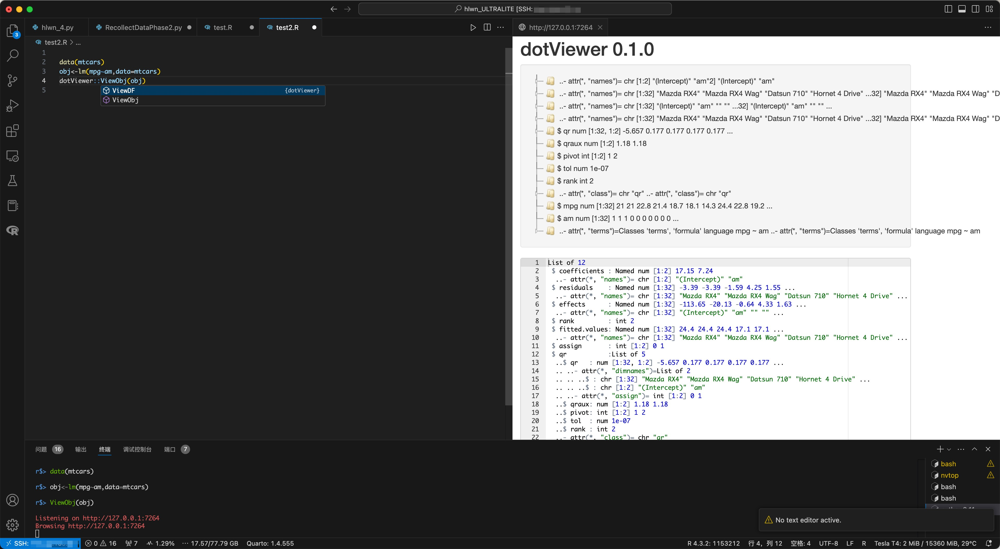
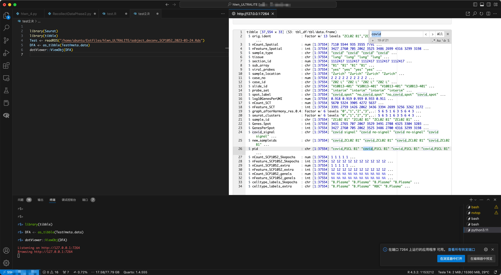
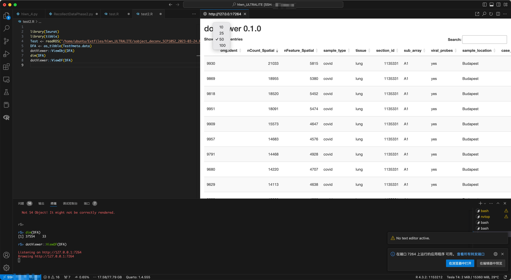
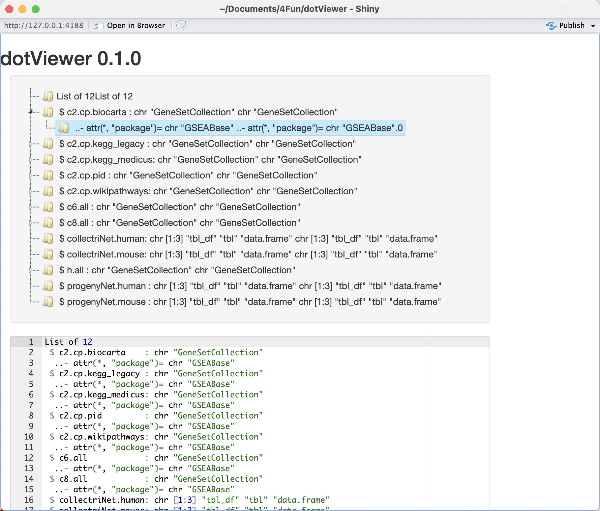

# VSCRViewer : Simple R Object Viewer in VSCode/Terminal

**VSCRViewer** is an R Packages that brings an RStudio-like variable object property preview to the VSCode environment. This tool is designed for R users who want to seamlessly explore the properties of their variables, especially complex objects like S4, directly within VSCode. This package is based on `shiny`.



## Features

-   **S4 Object Inspection**:

Easily inspect S4 objects' slots and structure, similar to the RStudio environment, by print `ViewObj(x)`.


-   **Comprehensive Property Overview**:

VSCRViewer parses the output of the `str()` function to generate a detailed property map using `ShinyTree`, providing a clear and organized overview of an object’s structure.



-   **S3 and Untested Object Compatibility**:

For objects like S3 and others that may not have been extensively tested, VSCRViewer offers an `AceEditor`-based editor. This editor allows for the preview of `str()` output with advanced features like syntax highlighting and search, enhancing your understanding of object structures, which are not supported in the default VSCode R extension.



-   **List Viewing**:

`ShinyTree` is based on list, you can use `ViewList` to view lists.

-   **DT-Based Table Preview**:

When working over SSH connections, loading large tables into the VSCode front-end can potentially cause instability. VSCRViewer addresses this by providing a preview pane based on DT for table objects, ensuring a more stable experience.



-   **Viewing Environment**:

Running in other place without RStudio is difficult to monitor environment, and `ViewEnv()` can help you.



-   **A better `print` function**

like this:

```         
> c("Age","Sex","Hobby","Country")
[1] "Age"     "Sex"     "Hobby"   "Country"
> test0<-c("Age","Sex","Hobby","Country")
> Print.Char(test0,Type = "plus")
~Age+Sex+Hobby+Country
> Print.Char(test0,Type = "c")
"Age","Sex","Hobby","Country"
> Print.Char(test0,Type = "tab")

Age
Sex
Hobby
Country
```

You can easily generate a formula, vector, or output genes to any websites like `metascape`.

-   **Integrated with VSCode**:

Enjoy the convenience of RStudio’s object inspection capabilities within the powerful VSCode editor.

## Installation

1.  **Requirement**:

    ```         
    packages <- c("dplyr", "DT", "shiny", "shinyAce", "shinyTree", "stringr","devtools")
    install_if_missing <- function(p) {
      if (!requireNamespace(p, quietly = TRUE)) {
        install.packages(p)
      }
    }
    sapply(packages, install_if_missing)
    ```

2.  **Setup**:

    ```         
    devtools::install_github("ZhimingYe/VSCRViewer")
    ```

## Usage

1.  **View S4 or others object**:

    ```         
    VSCRViewer::ViewObj(obj)
    ```

    The core implement is below. You can modify extract patterns by passing Pattern1\~3

    ```         
    dt<-capture.output(str(Test,strict.width="cut"))
    countlist<-c()
    for(i in 1:length(dt)){
        str <- sub("^\\s", "", dt[i])
        matches <- gregexpr("^(( ..)+)", str) # Pattern 1
        matched_part <- regmatches(str, matches)[[1]]
        count <- length(unlist(strsplit(matched_part, " ..")))
        countlist <- c(countlist,count)
    }
    library(stringr)
    Name1list<-c()
    for(i in 1:length(dt)){
        str <- sub(".*\\.\\.([@$#%^&*]+[^:]+):.*", "\\1", dt[i]) # Pattern 2
        Name1list <- c(Name1list,str)
    }
    Name2list<-c()
    for(i in 1:length(dt)){
        str <- sub(".*?:", "", dt[i]) # Pattern 3
        Name2list <- c(Name2list,str)
    }
    ```

2.  **Viewing tables:**

    ```         
    VSCRViewer::ViewDF(x,n = 10000) # You can determine how many rows is passed to DT
    ```

3.  **Viewing lists:**

    ```         
    VSCRViewer::ViewList(x)
    ```

4.  **Viewing environment:**

    ```         
    VSCRViewer::ViewEnv(x)
    ```

    ## License

GPL-V3
